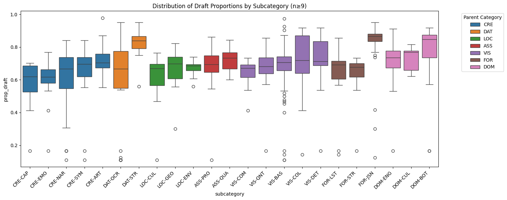

# Data-Centric Multimodal Speculative Decoding

This is a project by Haoli Yin and Siddharth Shah for the course Advanced Machine Learning at Vanderbilt University, Fall 2024. The aim of this project is to extend speculative decoding to vision-language models and to explore its potential benefits in the multimodal setting as compared to text-only speculative decoding. The full presentation slides can be found [here](https://docs.google.com/presentation/d/1E2Z8C9Z4aLtWfyCQUKfkw1SF6Tymd1AHHv1qILD_EFI/edit?usp=sharing) 

## Results

Due to limitations of system implementation (see limitations section), we don't aim to achieve practical speedups. Instead, we analyze the acceptance rate of k draft tokens in the multimodal speculative decoding process, varying the image content and task setting. We use the [WildVision-Bench](https://github.com/WildVision-AI/WildVision-Bench) test dataset of 500 samples for our experiments. 

We use an LLM APIs (Claude 3.5 Sonnet and GPT-4o) to classify the task instruction type into distinct categories for ease of analysis. All categories and subcategories can be found in `analysis/categorize_instructions.py`. We use the metric of `prop_draft` = `num_draft_tokens / num_tokens` per sample as a proxy metric for acceptance rate as higher `prop_draft` correlates with higher acceptance rate. We plot the results below: 



There are several interesting observations we can make from the results:
- 

### Limitations

We aren't able to achieve practical speedups due to the following limitations:
- TODO: fill in from presentation

## Getting Started

## Setup

We wanted to set this project up using the new `uv` tool for its incredibly fast dependency management.

Before doing anything, please install `uv` via curl using: 
```bash 
curl -LsSf https://astral.sh/uv/install.sh | sh
export PATH="$PATH:/home/ubuntu/.cargo/bin"
source ~/.bashrc
```

This project was created by first running `uv init mm-sd` to create a project template and then setting up a virtual environment by running: 
```bash 
uv venv --python 3.11.10
source .venv/bin/activate
```

## Installing dependencies:

To install all dependencies (except for flash-attn), run:
```bash
uv sync
```

TODO: create arg flag to disable flash attn since users might not have access to fancy GPU. 

To install flash-attn, please cross-check with the prebuilt wheel that matches your system specs. Please read this article for more details: https://til.simonwillison.net/python/installing-flash-attention

For example, here are my system specifications and the corresponding flash-attention wheel I installed:
- Python: 3.11.10
- CUDA: 12.1
- GPU: NVIDIA A10G (24GB VRAM)
- Driver: 535.183.01
- Instance: AWS g6.xlarge
- OS: Ubuntu 22.04
- Architecture: x86_64
- PyTorch: 2.3.1

I downloaded the matching wheel from the [flash-attention releases page](https://github.com/Dao-AILab/flash-attention/releases).
```bash
wget https://github.com/Dao-AILab/flash-attention/releases/download/v2.7.0.post2/flash_attn-2.7.0.post2+cu12torch2.3cxx11abiFALSE-cp311-cp311-linux_x86_64.whl

uv pip install --no-deps --upgrade flash_attn-2.7.0.post2+cu12torch2.3cxx11abiFALSE-cp311-cp311-linux_x86_64.whl
```


# Running Benchmark

See `parse_args()` in `run_qwen_wildvision.py` for a list of flags.

Running MSCOCO Captioning default task:
```bash
python benchmark_qwen_open.py --no_reduce_acceptance_rate --num_samples 3 --num_draft_samples 15 --trajectory
```

See `parse_args()` in `utils.py` for a list of flags.

Running WildVision-Bench various tasks: 
```bash
python run_qwen_wildvision.py --no_reduce_acceptance_rate --num_samples 500 --num_draft_samples 10 --trajectory
```